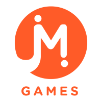

# IMI Games General Template 

> Refering this readme will help to understand the basic usages of this template to create games for IMI platform.

#### Notes
- [Pixi5 migration Guide](https://github.com/pixijs/pixi.js/wiki/v5-Migration-Guide)

---

### Table of Contents
You're sections headers will be used to reference location of destination.

- [Description](#description)
- [How To Use](#how-to-use)
- [References](#references)
- [License](#license)
- [Author Info](#author-info)

---

## Description

Previous development workflow of IMI games included a number of steps that were handled manually, which have to be implicitly kept in developers' mind. This template is created with the purpose of automating these steps and make an explicit and formalized development process.

#### Technologies

The technologies mentioned below are all installed and saved with the package.json in this project, ready for you. Further info can be collected via the reference links.

For the development of game loop
- <b> PIXI.js : </b> https://www.pixijs.com/ 
    A fast, lightweight rendering technique is useful for IMI games as the games should run within limited specs. Pixi.js is a WebGL renderer with an automatic Canvas fallback. Its Canvas fallback is useful to make the game work in devices without WebGL support.

For the automation of steps
- <b>Node.JS : </b> https://nodejs.org/en/ 
    The game template should be made to a proper developer environment, with possibility to expand. Node.jsis a javascript runtime built on Google Chrome's V8 javascript engine. The package manager (npm) offers more functionalities as packages, which can be added to the template environment. Additional functionalities can also be limited to runtime or development within the node project. 

- <b>Webpack</b> : https://webpack.js.org/ 
    <i>npm install --save-dev webpack</i> 
    Webpack is an open-source javascript module bundler that with configurable parameters. minified production bundles or non-minified test bundles can be created with preset configurations.

    All dependencies are bundled together during the bundling process. Developer can have code split in multiple files while webpack reads the dependencies among them and bundle to a single file.

    Webpack gives access to many other functionalities as plugins

    - <b>webpack dev server : </b>  
    https://webpack.js.org/configuration/dev-server/  
    <i>npm install --save-dev webpack-dev-server</i> 
    Webpack's dev server offers a server to host the game. Webpack's production build prcess includes automatic minification, which is a pro for faster downloads.

    - <b> Babel plugin for webpack : </b> 
    https://webpack.js.org/loaders/babel-loader/ 
    <i>npm install -D babel-loader @babel/core @babel/preset-env</i> 
    Javascript ES6 syntaxes such as arrow functions will be needed a downgrade to make them compatible with ES5 supporting browsers. Babel is a transpiling tool that does the exact thing.

    - <b>JavaScript Obfuscator and loader for webpack 4 : </b> 
    https://github.com/javascript-obfuscator/webpack-obfuscator 
    <i>npm install --save-dev webpack-obfuscator@2.6.0 javascript-obfuscator</i> 
    Obfuscating is useful to make the production build of the game unreadable to the end user.

    - <b>Copy Webpack plugin : </b>  
    https://www.webpackjs.com/plugins/copy-webpack-plugin/ 
    <i>npm install --save-dev copy-webpack-plugin</i> 
    While bundling the js files, the depending image and audio files will be copied to the final bundle folder through this plugin.

    - <b>HTML webpack plugin : </b> 
    https://webpack.js.org/plugins/html-webpack-plugin/ 
    <i>npm install --save-dev html-webpack-plugin</i> 
    Generates html files with the bundled js included in script tags

    - <b>Webpack CLI : </b> 
    https://webpack.js.org/api/cli/ 
    <i>npm install --save-dev webpack-cli</i> 
    A command line interface to run webpack commands

[Back To The Top](#IMI-Games-General-Template)

---

## How To Use

#### Installation
* Prerequisites : Your machine should have a version of Node.Js. Check your Node installation before downloading this template. Following template was initiated with v12.13.1 
<i>node -v</i> 

* With Node js installed, clone the template from git 
https://gitlab.com/imi-games/imi-automation.git

* After cloning the repository, install all the dependencies using this npm command. All the dependencies will be installed into a node_modules folder 
<i>npm install</i> 

* In imi_data.js, assign values to the IMI_DATA object and USER token variable. All the values can be retrieved from the imi dev console upon creating a new imi game entry.

* Now your template game is ready to go. Run the test_game server as given in the API reference section to test the game.

#### API Reference
Use the pre-configured shortcuts made with webpack to test and build your game. use the following commands with "npm run "

    build_production : bundle and obfuscate the code to make a final production ready game folder.
    build_staging : bundle a test version of the game.
    run_staging : run dev server with a test bundle of the game.
    run_production : run dev server with a production bundle of the game.

[Back To The Top](#IMI-Games-General-Template)

---

## References
- Readme templates : https://github.com/jamesqquick/read-me-template
 
[Back To The Top](#IMI-Games-General-Template)

---

## License

MIT License

Copyright (c) [2017] [James Q Quick]

Permission is hereby granted, free of charge, to any person obtaining a copy
of this software and associated documentation files (the "Software"), to deal
in the Software without restriction, including without limitation the rights
to use, copy, modify, merge, publish, distribute, sublicense, and/or sell
copies of the Software, and to permit persons to whom the Software is
furnished to do so, subject to the following conditions:

The above copyright notice and this permission notice shall be included in all
copies or substantial portions of the Software.

THE SOFTWARE IS PROVIDED "AS IS", WITHOUT WARRANTY OF ANY KIND, EXPRESS OR
IMPLIED, INCLUDING BUT NOT LIMITED TO THE WARRANTIES OF MERCHANTABILITY,
FITNESS FOR A PARTICULAR PURPOSE AND NONINFRINGEMENT. IN NO EVENT SHALL THE
AUTHORS OR COPYRIGHT HOLDERS BE LIABLE FOR ANY CLAIM, DAMAGES OR OTHER
LIABILITY, WHETHER IN AN ACTION OF CONTRACT, TORT OR OTHERWISE, ARISING FROM,
OUT OF OR IN CONNECTION WITH THE SOFTWARE OR THE USE OR OTHER DEALINGS IN THE
SOFTWARE.

[Back To The Top](#IMI-Games-General-Template)

---

## Author Info

- Buddhika Jayawickrama - [linkedin](https://www.linkedin.com/in/buddhikarj/)

[Back To The Top](#IMI-Games-General-Template)
